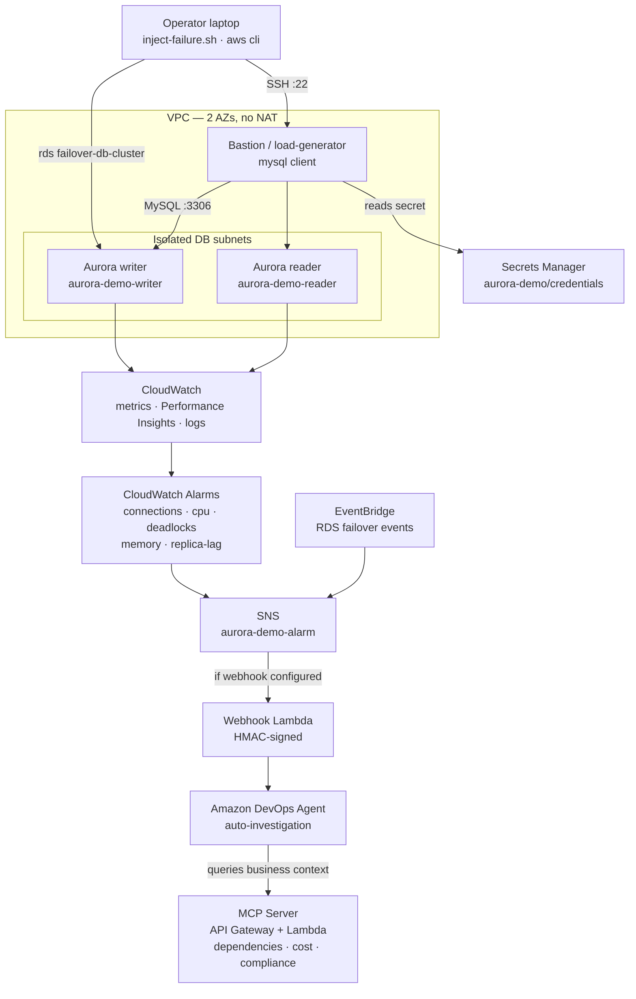

# Architecture — Aurora MySQL Incident Investigation with DevOps Agent

## Diagram



> Rendered above (GitHub + Kiro Markdown preview). A text-detail version follows.

## Component Overview

```
                        ┌─────────────────────────────────────────────────────────┐
                        │                    VPC (2 AZs, no NAT)                    │
                        │                                                           │
  Your laptop           │   Public subnet              Isolated (DB) subnets        │
  ┌──────────┐  SSH     │  ┌───────────────┐         ┌──────────────────────────┐  │
  │ inject-  │─────────▶│  │   Bastion /   │  MySQL   │  Aurora MySQL cluster     │  │
  │ failure  │  :22     │  │ load-generator│─────────▶│  writer: aurora-demo-writer│ │
  └──────────┘          │  │ (mysql client)│  :3306   │  reader: aurora-demo-reader│ │
        │               │  └───────┬───────┘         └───────────┬──────────────┘  │
        │ aws cli       │          │ reads secret               │ metrics/logs     │
        ▼               │          ▼                            ▼                   │
  rds failover-         │   Secrets Manager           CloudWatch (metrics,          │
  db-cluster ───────────┼──▶ aurora-demo/credentials   Performance Insights,        │
                        │                              error + slowquery logs)      │
                        └───────────────────────────────────┬───────────────────────┘
                                                             │
        CloudWatch alarms ──────────┐        EventBridge (RDS failover events)
        (connections, cpu,          │                 │
         deadlocks, memory,         ▼                 ▼
         replica-lag)          ┌─────────────────────────────┐
                               │      SNS: aurora-demo-alarm  │
                               └───────────────┬─────────────┘
                                               │ (only if --webhook-url given)
                                               ▼
                                    ┌────────────────────────┐        ┌──────────────────────┐
                                    │  Webhook Lambda (HMAC)  │───────▶│  Amazon DevOps Agent  │
                                    └────────────────────────┘        │  (investigation +     │
                                                                       │   MCP tool calls)     │
   MCP server (separate stack):                                        └───────────┬───────────┘
   API Gateway (api-key) → Lambda ─────────────── business context ◀───────────────┘
   (dependencies, cost impact, compliance, maintenance)
```

## Stacks

Two CDK stacks (region-suffixed IDs), both created from `infrastructure/cdk/app.py`:

- **`AuroraDemoStack-<region>`** (main; carries the solution-tracking tag)
  - `ec2.Vpc` — 2 AZs, `nat_gateways=0`, one public subnet group (bastion) and one `PRIVATE_ISOLATED` group (DB).
  - `rds.DatabaseCluster` — Aurora MySQL `8.0.mysql_aurora.3.08.0`, one writer + one reader (`db.r6g.large`, Graviton — required for Performance Insights, which burstable t3/t4g classes do not support), Performance Insights on, `error`/`slowquery` logs exported to CloudWatch, `storage_encrypted`, generated credentials in Secrets Manager (`aurora-demo/credentials`).
  - `ec2.Instance` bastion — `t3.micro`, public subnet, instance role with read on the DB secret + `rds:FailoverDBCluster`; UserData installs the MySQL client. Fixed identifiers (`aurora-demo-cluster/-writer/-reader`) keep alarm dimensions and inject scripts deterministic.
  - Six `cloudwatch.Alarm`s → SNS. EventBridge rule matches RDS failover event IDs → SNS.
  - Conditional webhook `lambda.Function` (created only when `webhookUrl` context is supplied) subscribed to the SNS topic; HMAC-signs and POSTs to the DevOps Agent webhook.
- **`AuroraDemoMcpServer-<region>`** (secondary; no tracking tag)
  - API Gateway (API-key protected) → Lambda serving the JSON-RPC MCP `initialize` / `tools/list` / `tools/call` methods from `mcp-server/app.py`.

## Investigation Flow

1. `inject-failure.sh <scenario>` SSHes to the bastion and runs `/opt/aurora-demo/inject`, which drives the Aurora writer/reader over the MySQL protocol (or calls `rds failover-db-cluster` for the failover scenario).
2. The workload moves a metric across an alarm threshold (or emits a failover event).
3. The alarm → SNS (or EventBridge → SNS) → webhook Lambda → DevOps Agent, which opens an investigation.
4. DevOps Agent reads CloudWatch metrics, Performance Insights, and the Aurora error/slow-query logs, then calls the MCP server for business context.
5. The agent produces a root-cause report and answers follow-up questions on demand.

## Design Notes & Well-Architected Alignment

- **Reliability**: reader replica + Multi-AZ failover; the `failover` scenario exercises real RTO. Alarms treat missing data as not-breaching so the steady state is clean.
- **Security**: DB is isolated (no public access), encrypted at rest, MySQL reachable only from the bastion SG; credentials live in Secrets Manager and are fetched via instance role — never written to disk or code. SSH defaults to the operator's IP.
- **Cost Optimization**: `nat_gateways=0` avoids NAT charges; Graviton `db.r6g.large` instances and a `t3.micro` bastion keep the running cost reasonable; `cleanup` destroys everything.
- **Operational Excellence**: one-command deploy/inject/rollback/cleanup; dedicated alarms are gated so only the intended signal fires per scenario.

### Trade-offs
- The bastion is intentionally public for a friction-free demo (SSH-in). In a hardened setup you would reach it via SSM Session Manager (the instance role already includes `AmazonSSMManagedInstanceCore`) and drop the public IP + port 22.
- `memory-pressure` and `replica-lag` are best-effort; on a 16 GB `db.r6g.large` freeable-memory pressure in particular is hard to force and needs sustained load. The four core scenarios (connections, CPU, deadlock, failover) are deterministic.
