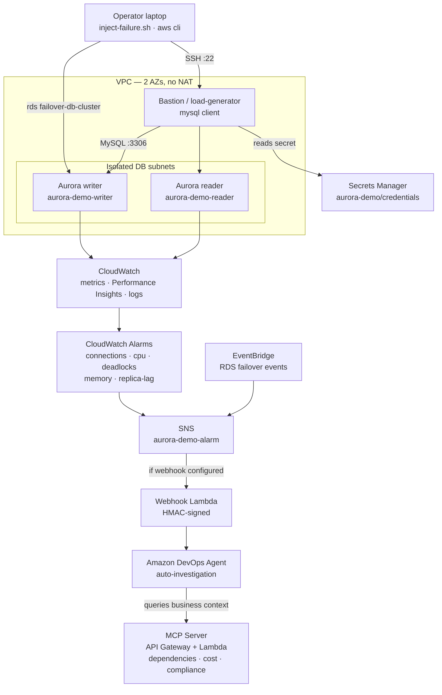

# Intelligent Aurora MySQL Incident Investigation with AWS DevOps Agent
*Your database degrades at 2 AM — instead of an on-call engineer digging through Performance Insights and error logs for 45 minutes, Amazon DevOps Agent investigates automatically, finds root cause, and quantifies the business impact.*

## Overview

Automated root-cause analysis for Amazon Aurora MySQL incidents. When a CloudWatch alarm fires (or a failover event occurs), an SNS → Lambda webhook notifies **Amazon DevOps Agent**, which reads CloudWatch metrics, Performance Insights, and the Aurora error/slow-query logs, correlates the signals, and enriches the finding with business context (dependent services, revenue-per-minute, compliance deadlines) via an **MCP server**. The result is an actionable incident report — not a wall of raw logs.

This is the database sibling to the EKS and Site-to-Site VPN DevOps Agent investigation demos.

## At a Glance
- **Duration**: ~25 minutes (Agent Space setup + infra deployment; Aurora cluster creation is ~10-15 min of that)
- **Difficulty**: Intermediate
- **Target Audience**: DBREs, SREs, Cloud Operations, TAMs running database-focused customer conversations
- **Key Technologies**: Amazon Aurora MySQL, CloudWatch, Performance Insights, SNS, Lambda, EventBridge, CDK (Python), Amazon DevOps Agent, MCP
- **Estimated Cost**: ~$0.55–0.90/hr while running (2× db.r6g.large Graviton Aurora instances + t3.micro bastion). Tear down with `cleanup` when done.

## Business Value

Database incidents are high-stakes and time-sensitive: a stalled writer blocks checkout, a connection storm takes down every dependent service, and a replica-lag spike quietly serves stale data. Mean-time-to-resolution is dominated by *triage* — figuring out *what* broke and *who* it affects. This demo shows how DevOps Agent collapses that triage from tens of minutes of manual log-reading into an automated, business-aware investigation, so engineers act on conclusions instead of assembling them.

## What You'll See

1. A healthy Aurora MySQL cluster (writer + reader) with CloudWatch alarms in OK state.
2. Inject a realistic failure with one command (e.g. a connection storm).
3. A CloudWatch alarm transitions to ALARM → SNS → Lambda webhook → DevOps Agent.
4. DevOps Agent opens an investigation on its own, reads metrics + logs, and identifies root cause.
5. The agent queries the MCP server for business context: dependent services, $/minute impact, compliance reporting deadlines, and recent changes.
6. A complete incident report, plus on-demand follow-up chat ("what are the remediation steps?").

## Prerequisites
- AWS CLI v2.31+ configured with credentials
- Node.js 20+ and Python 3.9+ (for CDK)
- An EC2 key pair in the target region
- OpenSSH client (`ssh`/`scp`) — preinstalled on macOS/Linux and Windows 10+
- Amazon DevOps Agent access in your account/region

## Deployment (Quick Start)

### 1. (Optional) Set up DevOps Agent + MCP server
```bash
bash scripts/setup-devops-agent.sh          # macOS/Linux
# ./scripts/setup-devops-agent.ps1           # Windows — see script for the guided steps
```
This deploys the MCP server stack and walks you through creating the Agent Space, webhook, and MCP registration in the DevOps Agent console. Copy the webhook URL + secret for the next step.

### 2. Deploy the Aurora demo
```bash
# macOS / Linux
bash deploy-all.sh --key-file ~/.ssh/your-key.pem \
  --webhook-url '<WEBHOOK_URL>' --webhook-secret '<WEBHOOK_SECRET>'
```
```powershell
# Windows
./deploy-all.ps1 -KeyFile "$HOME\.ssh\your-key.pem" `
  -WebhookUrl '<WEBHOOK_URL>' -WebhookSecret '<WEBHOOK_SECRET>'
```
Omit the webhook flags to deploy the environment without agent notifications (you can still watch alarms and Performance Insights).

## Running Scenarios
```bash
# Inject
bash scripts/inject-failure.sh connection-storm --key-file ~/.ssh/your-key.pem

# Roll back
bash scripts/inject-failure.sh connection-storm --key-file ~/.ssh/your-key.pem --rollback

# Status (injections + alarm states)
bash scripts/inject-failure.sh status --key-file ~/.ssh/your-key.pem
```

## Failure Scenarios

| Scenario | What it does | Signal / Alarm |
|----------|--------------|----------------|
| `connection-storm` | Opens ~200 held connections on the writer | `DatabaseConnections` high → `aurora-demo-connections-high` |
| `cpu-spike` | Runs CPU-burn query workers | `CPUUtilization` high → `aurora-demo-cpu-high` |
| `deadlock` | Two transactions lock rows in opposite order | InnoDB `Deadlocks` → `aurora-demo-deadlocks` |
| `failover` | `aws rds failover-db-cluster` — swaps writer/reader | RDS failover event via EventBridge → SNS |
| `memory-pressure` | Large sorts / temp tables (best-effort) | `FreeableMemory` low → `aurora-demo-memory-pressure` *(dedicated)* |
| `replica-lag` | Heavy write churn (best-effort) | `AuroraReplicaLag` high → `aurora-demo-replica-lag` *(dedicated)* |

Dedicated alarms start with their actions disabled; the inject script enables them before injecting and disables them on rollback (so they only fire for their scenario). `memory-pressure` and `replica-lag` are best-effort (harder to force on a larger instance) — the four core scenarios are the most demo-reliable.

## MCP Server Tools

| Tool | Input | Returns |
|------|-------|---------|
| `get_service_dependencies` | resource_id | Dependent services + criticality, on-call team, ~18K users affected |
| `get_cost_impact` | resource_id, downtime_minutes | Revenue loss ($5,100/min), orders/min, SLA breach status |
| `get_compliance_status` | resource_id | PCI-DSS / SOC 2 / GDPR reporting thresholds, data classification |
| `get_maintenance_context` | resource_id | Recent parameter/app/engine changes to correlate with the incident |

## Architecture



- **Network**: an Aurora MySQL cluster (writer + reader) sits in isolated subnets; a public bastion/load-generator injects scenarios over the MySQL protocol. No NAT gateway (cost).
- **Detection**: CloudWatch alarms (connections, CPU, deadlocks, memory, replica-lag) plus an EventBridge failover rule fan into a single SNS topic.
- **Investigation**: a conditional webhook Lambda notifies Amazon DevOps Agent, which reads CloudWatch metrics, Performance Insights, and Aurora logs, then queries an MCP server (API Gateway + Lambda) for business context (dependencies, cost impact, compliance).

See [ARCHITECTURE.md](ARCHITECTURE.md) for the full component breakdown and Well-Architected design notes.

## Cost & Cleanup

Running cost is dominated by the two `db.r6g.large` Aurora instances plus the bastion. Tear everything down when finished:
```bash
bash scripts/cleanup.sh $(aws configure get region)     # macOS/Linux
# ./scripts/cleanup.ps1 -Region <region>                 # Windows
```
Then manually remove the MCP server registration and Agent Space in the DevOps Agent console.

## Security Notes (demo-grade)

- The bastion is internet-facing on port 22; `deploy-all` restricts SSH to your current IP by default (`--ssh-open` widens it — avoid outside a demo).
- The Aurora cluster is **not** publicly accessible, is encrypted at rest, and only accepts MySQL from the bastion security group.
- Master credentials are generated into AWS Secrets Manager; the bastion reads them via an instance role. No passwords are stored in code or on disk.

## Contributing

We welcome community contributions! Please see [CONTRIBUTING.md](../../CONTRIBUTING.md) for guidelines.

## Security

See [CONTRIBUTING](../../CONTRIBUTING.md#security-issue-notifications) for more information.

## License

This library is licensed under the MIT-0 License. See the [LICENSE](../../LICENSE) file.
