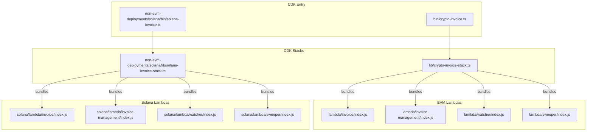

# Dependency Analysis

> **Navigation:** [← Components](components.md) | [Patterns →](patterns.md) | [Detailed Dependency Analysis →](../analysis/dependency-analysis.md)

## External Dependency Map

### EVM Root Project (`package.json`)

```mermaid
graph TD
    Root[crypto-invoice-cdk v1.0.0]
    
    subgraph "CDK Infrastructure"
        CDK[aws-cdk-lib ^2.192.0]
        Constructs[constructs ^10.3.0]
        Nag[cdk-nag ^2.28.0]
    end
    
    subgraph "AWS SDK"
        SDKv2[aws-sdk ^2.1692.0 ⚠️ v2]
        SDKv3_KMS[@aws-sdk/client-kms ^3.797.0]
        SDKv3_SM[@aws-sdk/client-secrets-manager ^3.797.0]
        Crypto[@aws-crypto/client-node ^4.2.1]
    end
    
    subgraph "Blockchain"
        Ethers[ethers ^6.14.3]
        BIP39[bip39 ^3.1.0]
    end
    
    subgraph "Utilities"
        QR[qrcode ^1.5.4]
        Dotenv[dotenv ^16.5.0]
        ESBuild[esbuild ^0.25.5]
    end
    
    Root --> CDK
    Root --> Constructs
    Root --> Nag
    Root --> SDKv2
    Root --> SDKv3_KMS
    Root --> SDKv3_SM
    Root --> Crypto
    Root --> Ethers
    Root --> BIP39
    Root --> QR
    Root --> Dotenv
    Root --> ESBuild
```

### EVM Lambda Dependencies

| Lambda | aws-sdk | ethers | qrcode | uuid | @aws-crypto |
|--------|---------|--------|--------|------|-------------|
| invoice | ^2.1692.0 | ^6.13.5 | ^1.5.4 | ^11.1.0 | ^4.2.1 |
| invoice-management | ^2.1000.0 | — | — | — | — |
| watcher | ^2.1692.0 | ^6.13.5 | — | — | — |
| sweeper | ^2.1692.0 | ^6.13.5 | — | — | — |

> ⚠️ **Critical:** All 4 EVM Lambda functions use AWS SDK v2. `invoice-management` uses an older version `^2.1000.0`.

### Solana Root Project (`non-evm-deployments/solana/package.json`)

| Dependency | Version | Purpose |
|------------|---------|---------|
| aws-cdk-lib | ^2.232.1 | CDK infrastructure (newer than EVM) |
| constructs | ^10.3.0 | CDK constructs |
| @aws-sdk/client-kms | ^3.948.0 | KMS for ed25519 signing |
| @solana/web3.js | ^1.95.8 | Solana blockchain interaction |
| @solana/spl-token | ^0.4.9 | SPL token handling |
| aws-sdk | ^2.1692.0 | ⚠️ Legacy (in root, not used by Lambdas) |
| bip39 | ^3.1.0 | Mnemonic generation |
| bs58 | ^6.0.0 | Base58 encoding |
| ed25519-hd-key | ^1.3.0 | Solana HD key derivation |
| qrcode | ^1.5.4 | QR code generation |
| dotenv | ^16.5.0 | Environment variables |
| esbuild | ^0.25.5 | Lambda bundling |

### Solana Lambda Dependencies

| Lambda | @aws-sdk/* | @solana/web3.js | @solana/spl-token | bip39 | ed25519-hd-key | bs58 |
|--------|-----------|-----------------|-------------------|-------|----------------|------|
| invoice | client-secrets-manager, client-dynamodb, lib-dynamodb | ^1.95.8 | — | ^3.1.0 | ^1.3.0 | — |
| invoice-management | client-dynamodb, lib-dynamodb | — | — | — | — | — |
| watcher | client-dynamodb, lib-dynamodb, client-sns | ^1.95.8 | ^0.4.9 | — | — | — |
| sweeper | client-secrets-manager, client-dynamodb, lib-dynamodb, client-kms, client-sns, util-dynamodb | ^1.95.8 | ^0.4.9 | ^3.1.0 | ^1.3.0 | ^6.0.0 |

> ✅ All Solana Lambda functions use AWS SDK v3 modular clients.

---

## Internal Dependency Graph



---

## SDK Version Inconsistencies

| Issue | Location | Severity |
|-------|----------|----------|
| EVM Lambdas use aws-sdk v2, Solana Lambdas use @aws-sdk v3 | All Lambda functions | 🔴 HIGH |
| invoice-management uses aws-sdk ^2.1000.0 (older) | lambda/invoice-management/package.json | 🟡 MEDIUM |
| EVM root has mixed v2 + v3 SDK | package.json | 🟡 MEDIUM |
| Solana root still has aws-sdk v2 listed | non-evm-deployments/solana/package.json | 🟡 MEDIUM |
| CDK versions differ: ^2.192.0 (EVM) vs ^2.232.1 (Solana) | Root package.json files | 🟢 LOW |
| ethers versions differ: ^6.14.3 (root) vs ^6.13.5 (Lambdas) | package.json files | 🟢 LOW |

---

## Related Documentation

- [System Overview →](system-overview.md)
- [Components →](components.md)
- [Detailed Dependency Analysis →](../analysis/dependency-analysis.md)
- [Technical Debt: Outdated Components →](../technical-debt/outdated-components.md)
