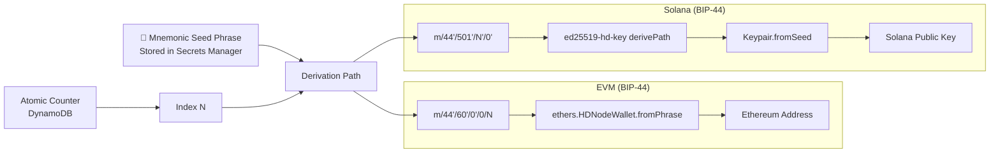
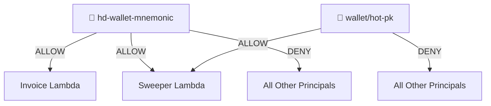
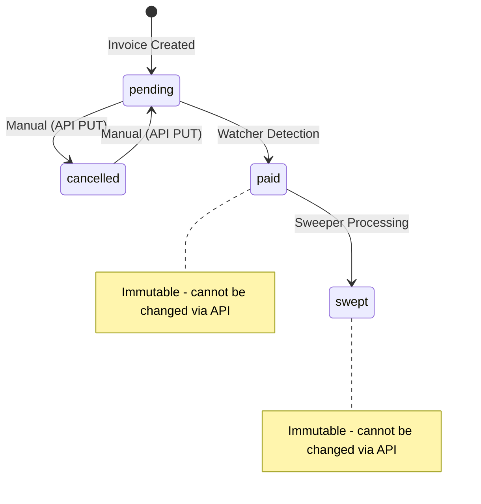

# Architecture Patterns

> **Navigation:** [← Dependencies](dependencies.md) | [System Overview →](system-overview.md) | [Business Logic →](../behavior/business-logic.md)

## Pattern Catalog

### 1. Event-Driven Architecture

The system follows an event-driven architecture with three trigger types:

| Trigger | Source | Target | Pattern |
|---------|--------|--------|---------|
| HTTP Request | API Gateway | Invoice / Management Lambda | Synchronous request-response |
| Scheduled Event | EventBridge (1-min rate) | Watcher Lambda | Periodic polling |
| Stream Event | DynamoDB Streams (filtered) | Sweeper Lambda | Change data capture |

**Design Choice:** Using DynamoDB Streams with event filters for the sweeper ensures exactly-once processing semantics with automatic retries and dead-letter handling, while avoiding polling overhead.

---

### 2. HD Wallet Derivation Pattern

Both EVM and Solana use Hierarchical Deterministic (HD) wallet derivation based on BIP-39/BIP-44 standards:



**Key Properties:**
- Deterministic: Same mnemonic + index always produces the same address
- Sequential: Atomic counter ensures unique index per invoice
- Recoverable: All addresses can be regenerated from mnemonic + counter history

---

### 3. Atomic Counter Pattern

Used for deterministic HD wallet index allocation:

```
DynamoDB Update Expression:
  SET currentIndex = if_not_exists(currentIndex, :start) + :inc
  ExpressionAttributeValues: { ':start': 0, ':inc': 1 }
  ReturnValues: UPDATED_NEW
```

- **Table:** Counter table
- **Key:** `{ counterId: 'hd-index' }` (EVM) / `{ counterId: 'solana-index' }` (Solana)
- **Guarantee:** Atomic increment prevents index collision even under concurrent invocations
- **Idempotency:** NOT idempotent — each call increments the counter

---

### 4. DynamoDB Stream-Triggered Processing

The Sweeper is triggered by DynamoDB Streams with event filtering:

```typescript
filters: [
  lambda.FilterCriteria.filter({
    eventName: lambda.FilterRule.isEqual('MODIFY'),
    dynamodb: {
      NewImage: {
        status: { S: lambda.FilterRule.isEqual('paid') },
      },
    },
  }),
]
```

**Configuration:**
- `batchSize: 1` — Process one invoice at a time
- `retryAttempts: 3` — Retry up to 3 times on failure
- `parallelizationFactor: 1` — Single concurrent processing
- `reportBatchItemFailures: true` — Report individual failures
- `reservedConcurrentExecutions: 1` — Only one sweeper instance

**Why:** This ensures funds are swept sequentially with proper error handling, preventing race conditions with gas top-ups and fund transfers.

---

### 5. Scheduled Polling Pattern (Watcher)

The Watcher Lambda uses EventBridge-scheduled invocation:

```
EventBridge Rule: rate(1 minute)
→ Watcher Lambda
  → Query DynamoDB (GSI: status-index, status=pending)
  → For each pending invoice:
    → Check blockchain balance via RPC
    → If balance >= required: markPaid → notifyMerchant
```

**Design Trade-offs:**
- ✅ Simple implementation, no webhook infrastructure needed
- ✅ Works with any blockchain RPC endpoint
- ⚠️ 1-minute polling interval means up to 1 minute payment detection delay
- ⚠️ Scales linearly with pending invoice count (all pending invoices checked each cycle)

---

### 6. Fund Sweeping Pattern

Two-phase fund consolidation from individual invoice wallets to treasury:

#### EVM Sweeping
1. Estimate gas for transfer
2. Add 10% gas buffer
3. If insufficient ETH for gas: hot wallet tops up the invoice address
4. Transfer full balance (minus gas) to treasury wallet
5. Mark invoice as `swept`

#### Solana Sweeping  
1. **SOL:** Estimate fee → transfer (balance - fee) to treasury
2. **SPL:** Create treasury ATA if needed → transfer tokens → close source ATA → KMS-sign transaction
3. Mark invoice as `swept`

**Error Recovery:** On failure, SNS notification is sent with CloudWatch log group reference for debugging.

---

### 7. API Key Authentication Pattern

All API endpoints require an API key via the `X-API-Key` header:

```
Merchant → API Gateway (X-API-Key validation) → Usage Plan (throttle/quota) → Lambda
```

- **Rate:** 100 requests/second
- **Burst:** 200 requests
- **Quota:** 10,000 requests/month
- **Note:** No Cognito/IAM authorizer — API key is sole authentication mechanism (acknowledged as POC limitation in CDK Nag suppressions)

---

### 8. Secrets Management Pattern

Two-tier secret access with resource policy restrictions:



**Implementation:** Uses `ArnNotEquals` condition to deny access to all principals except explicitly allowed Lambda execution roles.

---

### 9. Status State Machine Pattern

Invoice status transitions are strictly controlled:



**Rules:**
- `pending ↔ cancelled` — Bidirectional, API-controlled
- `pending → paid` — System-only (Watcher Lambda)
- `paid → swept` — System-only (Sweeper Lambda)
- `paid` and `swept` are immutable via API

---

## Related Documentation

- [System Overview →](system-overview.md)
- [Business Logic →](../behavior/business-logic.md)
- [Decision Logic →](../behavior/decision-logic.md)
- [Security Patterns →](../analysis/security-patterns.md)
