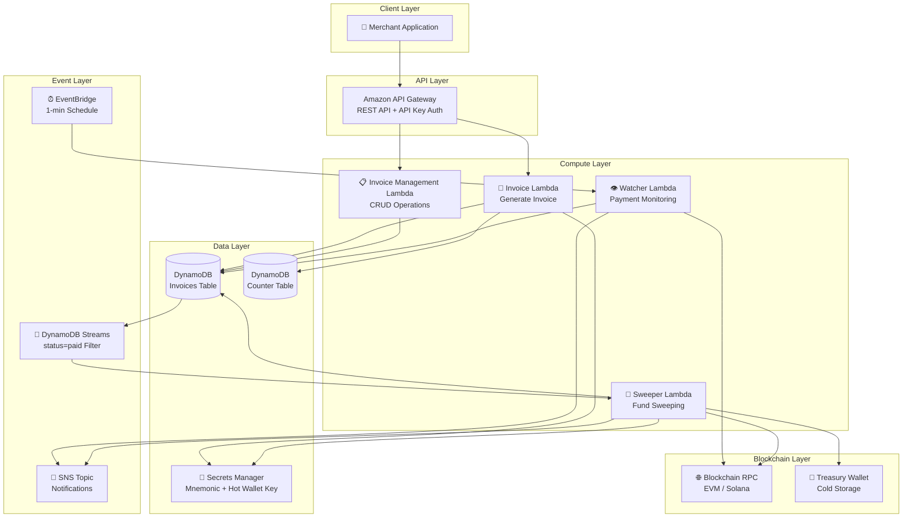
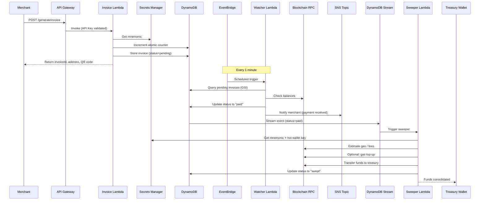

# System Architecture Overview

> **Navigation:** [← README](../README.md) | [Components →](components.md) | [Dependencies →](dependencies.md) | [Patterns →](patterns.md)

## Executive Summary

**crypto-invoice-cdk** is a serverless digital asset payment processing system deployed on AWS. It provides an end-to-end pipeline for creating cryptocurrency invoices, monitoring blockchain payments, and automatically sweeping funds to a treasury wallet. The system supports two blockchain ecosystems through parallel deployments:

- **EVM Stack** (`CryptoInvoiceStack`) — Ethereum and ERC20 tokens on any EVM-compatible chain
- **Solana Stack** (`SolanaInvoiceStack`) — Native SOL and SPL tokens on Solana

---

## High-Level System Architecture

---

## Data Flow Architecture

---

## Deployment Architecture

### EVM Deployment (`CryptoInvoiceStack`)

| Resource | Configuration |
|----------|---------------|
| **CDK Entry** | `bin/crypto-invoice.ts` |
| **Stack** | `lib/crypto-invoice-stack.ts` |
| **Lambda Runtime** | Node.js 22.x |
| **Lambda Memory** | 256 MB (all functions) |
| **Invoice Timeout** | 30 seconds |
| **Watcher Timeout** | 30 seconds |
| **Sweeper Timeout** | 15 minutes |
| **Sweeper Concurrency** | 1 (reserved) |
| **DynamoDB Billing** | PAY_PER_REQUEST |
| **DynamoDB Stream** | NEW_IMAGE |
| **EventBridge Schedule** | Every 1 minute |
| **API Stage** | `prod` |
| **API Throttle** | 100 req/s rate, 200 burst |
| **API Quota** | 10,000 req/month |
| **Log Retention** | 2 weeks (general), 1 month (sweeper) |
| **CDK Nag** | AwsSolutionsChecks enabled |

### Solana Deployment (`SolanaInvoiceStack`)

| Resource | Configuration |
|----------|---------------|
| **CDK Entry** | `non-evm-deployments/solana/bin/solana-invoice.ts` |
| **Stack** | `non-evm-deployments/solana/lib/solana-invoice-stack.ts` |
| **Lambda Runtime** | Node.js 22.x |
| **Lambda Memory** | 256 MB (all functions) |
| **KMS Key** | ECC_NIST_EDWARDS25519 (for hot wallet signing) |
| **Hot Wallet** | KMS-based ed25519 signing (no raw private key) |
| **Region** | Configurable (default: us-east-1) |

> **Key Difference:** The Solana stack uses AWS KMS for ed25519 signing instead of storing a raw private key in Secrets Manager, representing an improved security posture.

---

## AWS Service Configuration Details

### Lambda Function Settings

| Function | Memory | Timeout | Reserved Concurrency | Event Source |
|----------|--------|---------|---------------------|--------------|
| Invoice | 256 MB | 30s | Default | API Gateway (POST) |
| Invoice Management | 256 MB | 30s | Default | API Gateway (GET/PUT/DELETE) |
| Watcher | 256 MB | 30s | Default | EventBridge (1-min rate) |
| Sweeper | 256 MB | 15 min | 1 | DynamoDB Stream (filtered) |

### DynamoDB Tables

| Table | Partition Key | Billing | Stream | GSI |
|-------|--------------|---------|--------|-----|
| Invoices | `invoiceId` (S) | PAY_PER_REQUEST | NEW_IMAGE | `status-index` (status → ALL) |
| Counter | `counterId` (S) | PAY_PER_REQUEST | None | None |

### API Gateway Configuration

- **Type:** REST API
- **Stage:** `prod`
- **Auth:** API Key required on all endpoints
- **CORS:** ALL_ORIGINS, ALL_METHODS ⚠️
- **Logging:** JSON format, INFO level, data trace enabled ⚠️
- **Usage Plan:** 100 req/s, 200 burst, 10K/month quota

---

## Environment Variables

### EVM Stack
| Lambda | Variables |
|--------|-----------|
| Invoice | `TABLE`, `COUNTER_TABLE` |
| Invoice Management | `TABLE` |
| Watcher | `TABLE`, `RPC_URL`, `SNS_TOPIC_ARN` |
| Sweeper | `TABLE`, `TREASURY_PUBLIC_ADDRESS`, `RPC_URL`, `SNS_TOPIC_ARN` |

### Solana Stack
| Lambda | Variables |
|--------|-----------|
| Invoice | `TABLE`, `COUNTER_TABLE` |
| Invoice Management | `TABLE` |
| Watcher | `TABLE`, `SOLANA_RPC_URL`, `SNS_TOPIC_ARN` |
| Sweeper | `TABLE`, `SOLANA_TREASURY_PUBLIC_KEY`, `SOLANA_RPC_URL`, `SNS_TOPIC_ARN`, `KMS_KEY_ID` |

---

## Related Documentation

- [Component Details →](components.md)
- [Dependency Map →](dependencies.md)
- [Architecture Patterns →](patterns.md)
- [API Reference →](../reference/api-reference.md)
- [Technical Debt Report →](../technical-debt-report.md)
