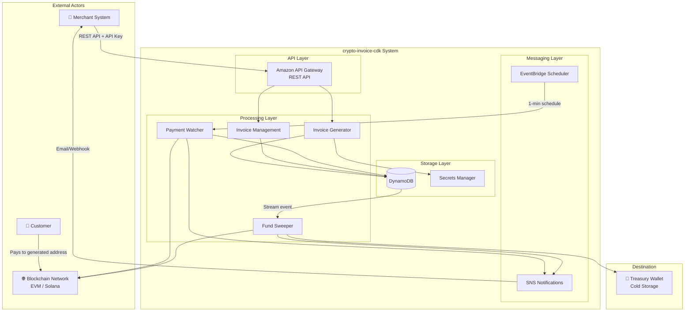
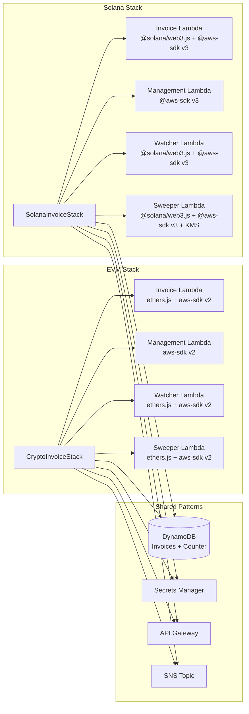

# System Context Diagram

```mermaid
graph TB
    subgraph "External Actors"
        Merchant[🏪 Merchant System]
        Customer[👤 Customer]
        Blockchain[🌐 Blockchain Network<br/>EVM / Solana]
    end

    subgraph "crypto-invoice-cdk System"
        subgraph "API Layer"
            APIGW[Amazon API Gateway<br/>REST API]
        end
        
        subgraph "Processing Layer"
            Invoice[Invoice Generator]
            Management[Invoice Management]
            Watcher[Payment Watcher]
            Sweeper[Fund Sweeper]
        end
        
        subgraph "Storage Layer"
            DDB[(DynamoDB)]
            Secrets[Secrets Manager]
        end
        
        subgraph "Messaging Layer"
            SNS[SNS Notifications]
            EB[EventBridge Scheduler]
        end
    end

    subgraph "Destination"
        Treasury[🏦 Treasury Wallet<br/>Cold Storage]
    end

    Merchant -->|REST API + API Key| APIGW
    Customer -->|Pays to generated address| Blockchain
    APIGW --> Invoice
    APIGW --> Management
    Invoice --> DDB
    Invoice --> Secrets
    Management --> DDB
    EB -->|1-min schedule| Watcher
    Watcher --> DDB
    Watcher --> Blockchain
    Watcher --> SNS
    DDB -->|Stream event| Sweeper
    Sweeper --> Blockchain
    Sweeper --> Treasury
    Sweeper --> SNS
    SNS -->|Email/Webhook| Merchant
```

# Component Relationship Diagram

```mermaid
graph LR
    subgraph "EVM Stack"
        E_Stack[CryptoInvoiceStack]
        E_Inv[Invoice Lambda<br/>ethers.js + aws-sdk v2]
        E_Mgmt[Management Lambda<br/>aws-sdk v2]
        E_Watch[Watcher Lambda<br/>ethers.js + aws-sdk v2]
        E_Sweep[Sweeper Lambda<br/>ethers.js + aws-sdk v2]
        
        E_Stack --> E_Inv
        E_Stack --> E_Mgmt
        E_Stack --> E_Watch
        E_Stack --> E_Sweep
    end

    subgraph "Solana Stack"
        S_Stack[SolanaInvoiceStack]
        S_Inv[Invoice Lambda<br/>@solana/web3.js + @aws-sdk v3]
        S_Mgmt[Management Lambda<br/>@aws-sdk v3]
        S_Watch[Watcher Lambda<br/>@solana/web3.js + @aws-sdk v3]
        S_Sweep[Sweeper Lambda<br/>@solana/web3.js + @aws-sdk v3 + KMS]
        
        S_Stack --> S_Inv
        S_Stack --> S_Mgmt
        S_Stack --> S_Watch
        S_Stack --> S_Sweep
    end

    subgraph "Shared Patterns"
        DDB[(DynamoDB<br/>Invoices + Counter)]
        SM[Secrets Manager]
        API[API Gateway]
        SNS[SNS Topic]
    end
    
    E_Stack --> DDB
    E_Stack --> SM
    E_Stack --> API
    E_Stack --> SNS
    S_Stack --> DDB
    S_Stack --> SM
    S_Stack --> API
    S_Stack --> SNS
```
