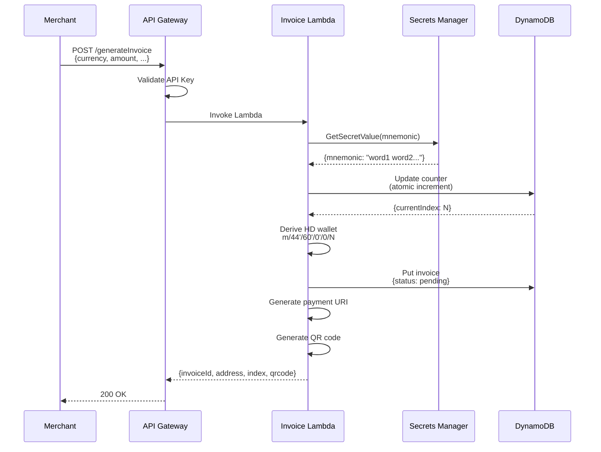
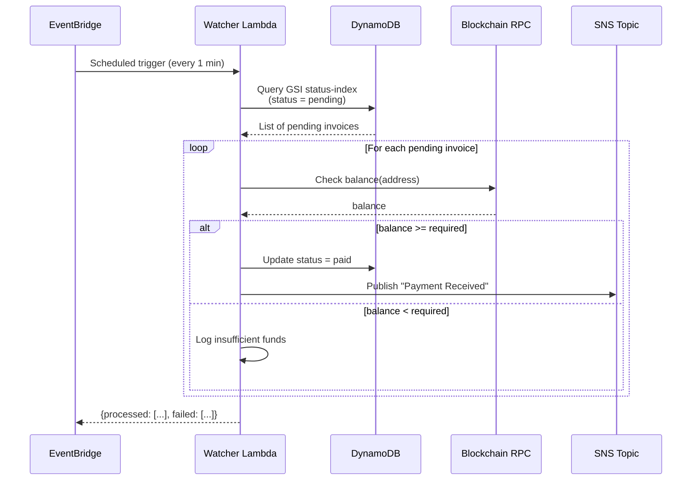
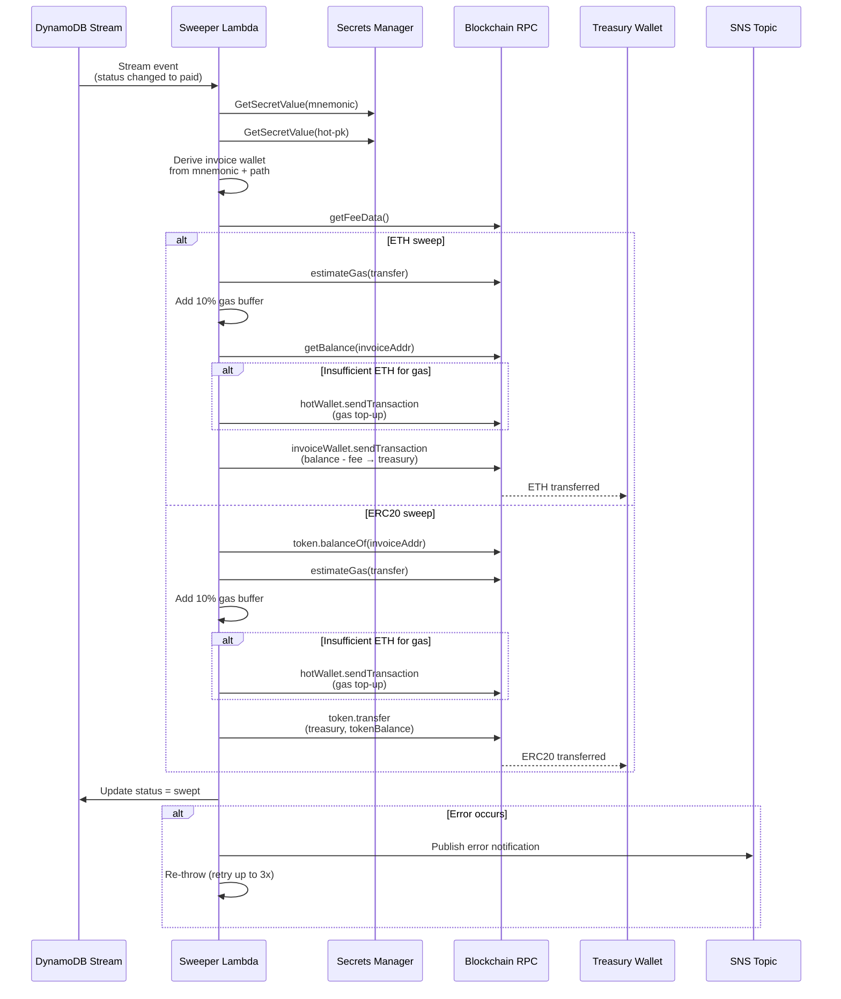
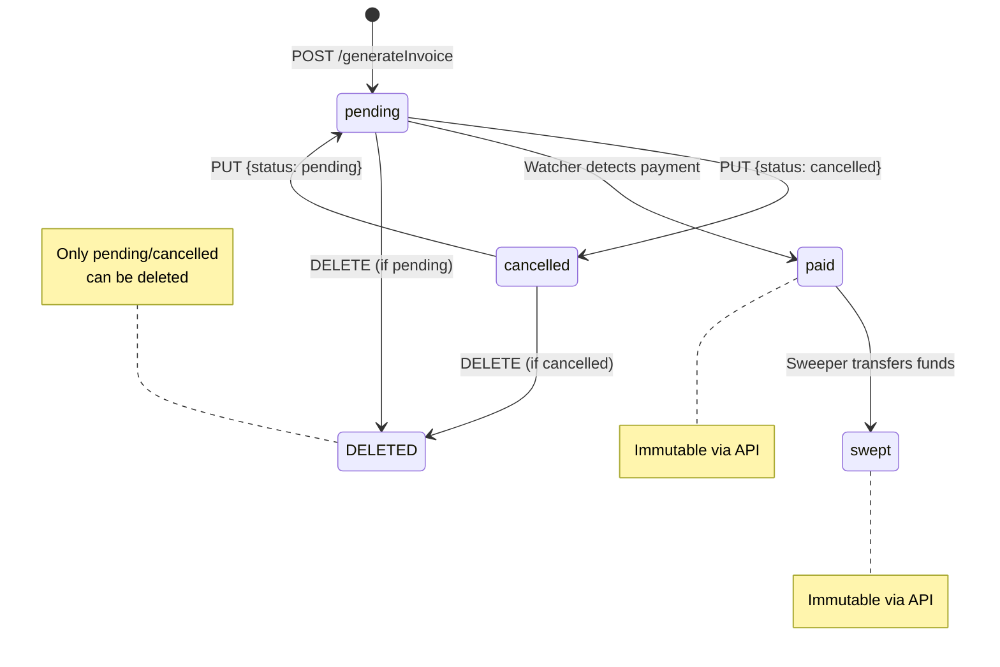

# Payment Flow Diagrams

## Invoice Creation Sequence

```mermaid
sequenceDiagram
    participant M as Merchant
    participant API as API Gateway
    participant INV as Invoice Lambda
    participant SM as Secrets Manager
    participant DDB as DynamoDB
    
    M->>API: POST /generateInvoice<br/>{currency, amount, ...}
    API->>API: Validate API Key
    API->>INV: Invoke Lambda
    INV->>SM: GetSecretValue(mnemonic)
    SM-->>INV: {mnemonic: "word1 word2..."}
    INV->>DDB: Update counter<br/>(atomic increment)
    DDB-->>INV: {currentIndex: N}
    INV->>INV: Derive HD wallet<br/>m/44'/60'/0'/0/N
    INV->>DDB: Put invoice<br/>{status: pending}
    INV->>INV: Generate payment URI
    INV->>INV: Generate QR code
    INV-->>API: {invoiceId, address, index, qrcode}
    API-->>M: 200 OK
```

## Payment Detection Sequence

```mermaid
sequenceDiagram
    participant EB as EventBridge
    participant W as Watcher Lambda
    participant DDB as DynamoDB
    participant RPC as Blockchain RPC
    participant SNS as SNS Topic
    
    EB->>W: Scheduled trigger (every 1 min)
    W->>DDB: Query GSI status-index<br/>(status = pending)
    DDB-->>W: List of pending invoices
    
    loop For each pending invoice
        W->>RPC: Check balance(address)
        RPC-->>W: balance
        alt balance >= required
            W->>DDB: Update status = paid
            W->>SNS: Publish "Payment Received"
        else balance < required
            W->>W: Log insufficient funds
        end
    end
    
    W-->>EB: {processed: [...], failed: [...]}
```

## Fund Sweeping Sequence (EVM)

```mermaid
sequenceDiagram
    participant DDB as DynamoDB Stream
    participant S as Sweeper Lambda
    participant SM as Secrets Manager
    participant RPC as Blockchain RPC
    participant T as Treasury Wallet
    participant SNS as SNS Topic
    
    DDB->>S: Stream event<br/>(status changed to paid)
    S->>SM: GetSecretValue(mnemonic)
    S->>SM: GetSecretValue(hot-pk)
    S->>S: Derive invoice wallet<br/>from mnemonic + path
    S->>RPC: getFeeData()
    
    alt ETH sweep
        S->>RPC: estimateGas(transfer)
        S->>S: Add 10% gas buffer
        S->>RPC: getBalance(invoiceAddr)
        alt Insufficient ETH for gas
            S->>RPC: hotWallet.sendTransaction<br/>(gas top-up)
        end
        S->>RPC: invoiceWallet.sendTransaction<br/>(balance - fee → treasury)
        RPC-->>T: ETH transferred
    else ERC20 sweep
        S->>RPC: token.balanceOf(invoiceAddr)
        S->>RPC: estimateGas(transfer)
        S->>S: Add 10% gas buffer
        alt Insufficient ETH for gas
            S->>RPC: hotWallet.sendTransaction<br/>(gas top-up)
        end
        S->>RPC: token.transfer<br/>(treasury, tokenBalance)
        RPC-->>T: ERC20 transferred
    end
    
    S->>DDB: Update status = swept
    
    alt Error occurs
        S->>SNS: Publish error notification
        S->>S: Re-throw (retry up to 3x)
    end
```

## Invoice Lifecycle State Diagram

```mermaid
stateDiagram-v2
    [*] --> pending: POST /generateInvoice
    
    pending --> cancelled: PUT {status: cancelled}
    cancelled --> pending: PUT {status: pending}
    
    pending --> paid: Watcher detects payment
    paid --> swept: Sweeper transfers funds
    
    pending --> DELETED: DELETE (if pending)
    cancelled --> DELETED: DELETE (if cancelled)
    
    note right of paid: Immutable via API
    note right of swept: Immutable via API
    note left of DELETED: Only pending/cancelled<br/>can be deleted
```
