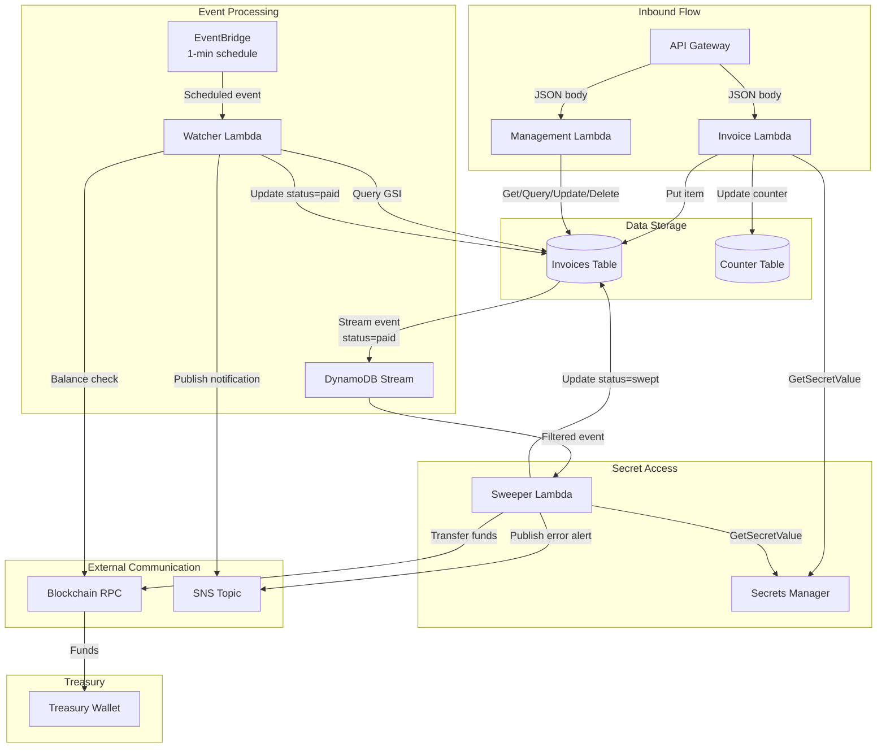
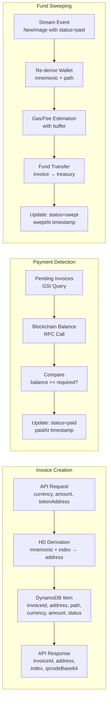

# Service Data Flow Diagrams

## AWS Service Data Flow



## Data Transformation Flow



## Secrets Data Flow

```mermaid
graph TD
    subgraph "EVM Secrets Flow"
        SM_MN[Secrets Manager<br/>hd-wallet-mnemonic<br/>{mnemonic: "..."}]
        SM_PK[Secrets Manager<br/>wallet/hot-pk<br/>{pk: "0x..."}]
        
        SM_MN -->|Read| EVM_INV[Invoice Lambda<br/>→ HD wallet derivation]
        SM_MN -->|Read| EVM_SWEEP[Sweeper Lambda<br/>→ Re-derive invoice wallet]
        SM_PK -->|Read| EVM_SWEEP
    end
    
    subgraph "Solana Secrets Flow"
        SM_SOL[Secrets Manager<br/>solana-wallet-mnemonic<br/>{mnemonic: "..."}]
        KMS[KMS Key<br/>Ed25519 (SIGN_VERIFY)]
        
        SM_SOL -->|Read| SOL_INV[Invoice Lambda<br/>→ ed25519 key derivation]
        SM_SOL -->|Read| SOL_SWEEP[Sweeper Lambda<br/>→ Re-derive invoice keypair]
        KMS -->|GetPublicKey| SOL_SWEEP
        KMS -->|Sign| SOL_SWEEP
    end
```
