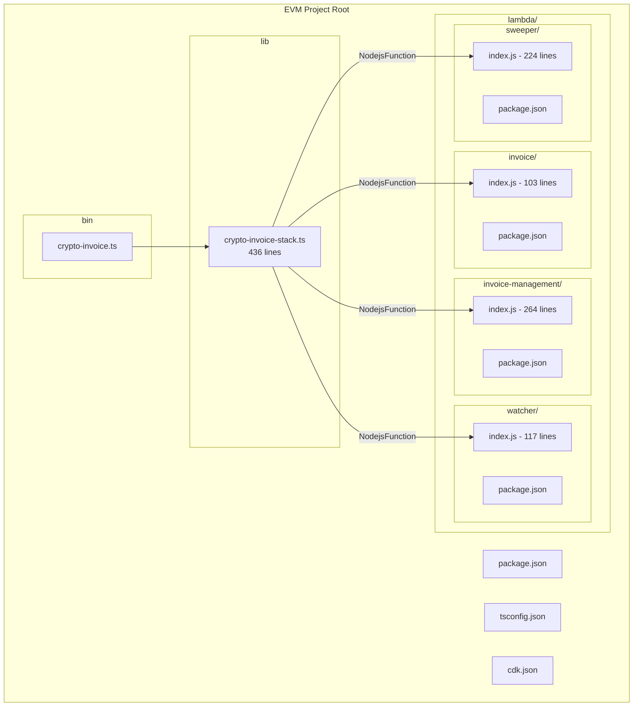
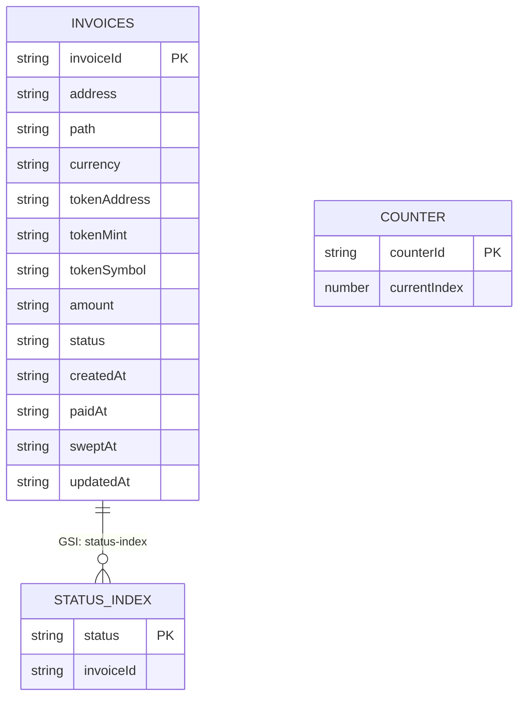

# Structural Diagrams

## Deployment Topology

```mermaid
graph TB
    subgraph "AWS Account"
        subgraph "EVM Stack (CryptoInvoiceStack)"
            E_API[API Gateway<br/>Invoice Service]
            E_INV[Lambda: InvoiceFunction<br/>256MB / 30s]
            E_MGMT[Lambda: InvoiceManagementFunction<br/>256MB / 30s]
            E_WATCH[Lambda: WatcherFunction<br/>256MB / 30s]
            E_SWEEP[Lambda: SweeperFunction<br/>256MB / 15min / concurrency=1]
            E_DDB_INV[(DynamoDB: CryptoInvoices<br/>PAY_PER_REQUEST + Stream)]
            E_DDB_CTR[(DynamoDB: HdWalletCounter<br/>PAY_PER_REQUEST)]
            E_SM_MN[Secrets: hd-wallet-mnemonic]
            E_SM_PK[Secrets: wallet/hot-pk]
            E_SNS[SNS: Merchant Notifications]
            E_EB[EventBridge: 1-min rule]
            E_CW[CloudWatch Log Groups<br/>2wk / 1mo retention]
        end

        subgraph "Solana Stack (SolanaInvoiceStack)"
            S_API[API Gateway<br/>Solana Invoice Service]
            S_INV[Lambda: SolanaInvoiceFunction<br/>256MB / 30s]
            S_MGMT[Lambda: SolanaInvoiceManagementFunction<br/>256MB / 30s]
            S_WATCH[Lambda: SolanaWatcherFunction<br/>256MB / 30s]
            S_SWEEP[Lambda: SolanaSweeperFunction<br/>256MB / 15min / concurrency=1]
            S_DDB_INV[(DynamoDB: SolanaInvoices<br/>PAY_PER_REQUEST + Stream)]
            S_DDB_CTR[(DynamoDB: SolanaWalletCounter<br/>PAY_PER_REQUEST)]
            S_SM_MN[Secrets: solana-wallet-mnemonic]
            S_KMS[KMS: Ed25519 Signing Key]
            S_SNS[SNS: Solana Notifications]
            S_EB[EventBridge: 1-min rule]
            S_CW[CloudWatch Log Groups<br/>2wk / 1mo retention]
        end
    end

    subgraph "External"
        EVM_RPC[EVM RPC Endpoint]
        SOL_RPC[Solana RPC Endpoint]
        EVM_Treasury[EVM Treasury Wallet]
        SOL_Treasury[Solana Treasury Wallet]
    end

    E_SWEEP --> EVM_RPC
    E_SWEEP --> EVM_Treasury
    S_SWEEP --> SOL_RPC
    S_SWEEP --> SOL_Treasury
```

## Module Structure

```mermaid
graph TD
    subgraph "EVM Project Root"
        pkg[package.json]
        ts[tsconfig.json]
        cdk[cdk.json]
        
        subgraph bin
            entry[crypto-invoice.ts]
        end
        
        subgraph lib
            stack[crypto-invoice-stack.ts<br/>436 lines]
        end
        
        subgraph "lambda/"
            subgraph "invoice/"
                inv_js[index.js - 103 lines]
                inv_pkg[package.json]
            end
            subgraph "invoice-management/"
                mgmt_js[index.js - 264 lines]
                mgmt_pkg[package.json]
            end
            subgraph "watcher/"
                watch_js[index.js - 117 lines]
                watch_pkg[package.json]
            end
            subgraph "sweeper/"
                sweep_js[index.js - 224 lines]
                sweep_pkg[package.json]
            end
        end
    end

    entry --> stack
    stack -->|NodejsFunction| inv_js
    stack -->|NodejsFunction| mgmt_js
    stack -->|NodejsFunction| watch_js
    stack -->|NodejsFunction| sweep_js
```

## DynamoDB Table Schema

```mermaid
erDiagram
    INVOICES {
        string invoiceId PK
        string address
        string path
        string currency
        string tokenAddress
        string tokenMint
        string tokenSymbol
        string amount
        string status
        string createdAt
        string paidAt
        string sweptAt
        string updatedAt
    }
    
    COUNTER {
        string counterId PK
        number currentIndex
    }
    
    STATUS_INDEX {
        string status PK
        string invoiceId
    }
    
    INVOICES ||--o{ STATUS_INDEX : "GSI: status-index"
```
