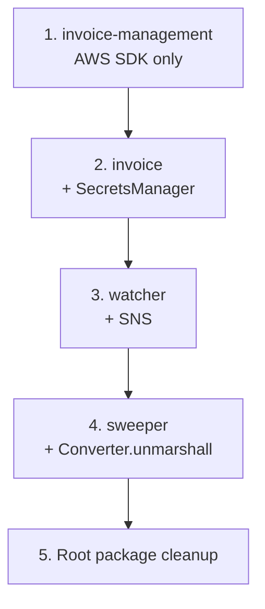

# Component Migration Order

> **Navigation:** [← README](../README.md) | [Test Specifications →](test-specifications.md) | [Validation Criteria →](validation-criteria.md)

## Recommended Migration Order for AWS SDK v2 → v3

Based on dependency analysis and complexity assessment, components should be migrated in this order:

### Phase 1: Lowest Risk — Invoice Management Lambda
1. **`lambda/invoice-management/index.js`** — Simplest Lambda, only DynamoDB operations, no blockchain dependencies. Reference: `non-evm-deployments/solana/lambda/invoice-management/index.js` is the v3 equivalent.

### Phase 2: Low Risk — Invoice Lambda
2. **`lambda/invoice/index.js`** — Sequential flow, uses SecretsManager + DynamoDB. Reference: `non-evm-deployments/solana/lambda/invoice/index.js`.

### Phase 3: Medium Risk — Watcher Lambda
3. **`lambda/watcher/index.js`** — Uses DynamoDB + SNS. The ethers.js code is unchanged, only AWS SDK calls need migration. Reference: `non-evm-deployments/solana/lambda/watcher/index.js`.

### Phase 4: Highest Risk — Sweeper Lambda
4. **`lambda/sweeper/index.js`** — Most complex, uses SecretsManager + DynamoDB + SNS + `AWS.DynamoDB.Converter.unmarshall`. Financial operations require extra care. Reference: `non-evm-deployments/solana/lambda/sweeper/index.js`.

### Phase 5: Root Package Cleanup
5. **`package.json`** — Remove `aws-sdk` v2 dependency from root
6. **`non-evm-deployments/solana/package.json`** — Remove unused `aws-sdk` v2

## Migration Dependencies

→ [Dependency Analysis](../analysis/dependency-analysis.md) | [Remediation Plan](../technical-debt/remediation-plan.md)
