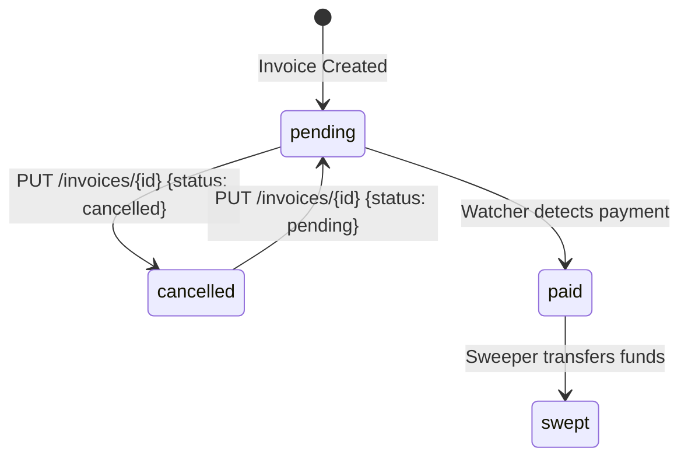

# Data Models

> **Navigation:** [← Interfaces](interfaces.md) | [Program Structure →](program-structure.md) | [Architecture Components →](../architecture/components.md)

## DynamoDB Tables

### Invoices Table

**Table Name:** `CryptoInvoices` (EVM) / `SolanaInvoices` (Solana)  
**Partition Key:** `invoiceId` (String)  
**Billing Mode:** PAY_PER_REQUEST  
**Stream:** NEW_IMAGE  
**Global Secondary Index:** `status-index` (partition: `status`, projection: ALL)

#### Schema

| Attribute | Type | Required | Set By | Description |
|-----------|------|----------|--------|-------------|
| `invoiceId` | String (UUID) | ✅ | Invoice Lambda | Unique identifier (partition key) |
| `address` | String | ✅ | Invoice Lambda | HD-derived wallet address |
| `path` | String | ✅ | Invoice Lambda | BIP-44 derivation path |
| `currency` | String | ✅ | Invoice Lambda | Currency type (see enum below) |
| `tokenAddress` | String / null | ERC20 only | Invoice Lambda | ERC20 contract address |
| `tokenMint` | String / null | SPL only | Invoice Lambda | SPL token mint address |
| `tokenSymbol` | String | ✅ | Invoice Lambda | Token display symbol |
| `amount` | String | ✅ | Invoice Lambda | Payment amount |
| `status` | String | ✅ | Multiple | Current invoice status (see enum below) |
| `createdAt` | String (ISO 8601) | ✅ | Invoice Lambda | Creation timestamp |
| `paidAt` | String (ISO 8601) | When paid | Watcher Lambda | Payment detection timestamp |
| `sweptAt` | String (ISO 8601) | When swept | Sweeper Lambda | Fund sweep timestamp |
| `updatedAt` | String (ISO 8601) | When updated | Management Lambda | Manual update timestamp |

#### Currency Enum

| Value | Stack | Description |
|-------|-------|-------------|
| `ETH` | EVM | Native Ether |
| `ERC20` | EVM | ERC20 token (requires tokenAddress) |
| `SOL` | Solana | Native SOL |
| `SPL` | Solana | SPL token (requires tokenMint) |

#### Status Enum and Transitions

| Status | Description | Set By | Mutable via API? |
|--------|-------------|--------|-----------------|
| `pending` | Invoice created, awaiting payment | Invoice Lambda | ✅ (to cancelled) |
| `cancelled` | Invoice cancelled by merchant | Management Lambda | ✅ (to pending) |
| `paid` | Payment detected on blockchain | Watcher Lambda | ❌ Immutable |
| `swept` | Funds transferred to treasury | Sweeper Lambda | ❌ Immutable |



#### Transition Matrix

| From \ To | pending | cancelled | paid | swept |
|-----------|---------|-----------|------|-------|
| pending | — | ✅ API | ✅ Watcher | — |
| cancelled | ✅ API | — | — | — |
| paid | ❌ | ❌ | — | ✅ Sweeper |
| swept | ❌ | ❌ | ❌ | — |

#### Deletion Rules
- Only `pending` and `cancelled` invoices can be deleted
- EVM: Uses `ConditionExpression` on delete operation
- Solana: Pre-fetches and checks status before delete

---

### Counter Table

**Table Name:** `HdWalletCounter` (EVM) / `SolanaWalletCounter` (Solana)  
**Partition Key:** `counterId` (String)  
**Billing Mode:** PAY_PER_REQUEST

| Attribute | Type | Description |
|-----------|------|-------------|
| `counterId` | String | Key identifier (`"hd-index"` for EVM, `"solana-index"` for Solana) |
| `currentIndex` | Number | Current HD wallet derivation index (auto-incremented) |

**Atomic Update Expression:**
```
SET currentIndex = if_not_exists(currentIndex, :start) + :inc
ExpressionAttributeValues: { ':start': 0, ':inc': 1 }
ReturnValues: UPDATED_NEW
```

---

## Secrets Manager Structures

### HD Wallet Mnemonic

**EVM Secret Name:** `hd-wallet-mnemonic`  
**Solana Secret Name:** `solana-wallet-mnemonic`

```json
{
  "mnemonic": "word1 word2 word3 ... word12"
}
```

- BIP-39 compliant 12-word or 24-word seed phrase
- Used for deterministic wallet address derivation
- Access restricted to Invoice Lambda and Sweeper Lambda via resource policy

### Hot Wallet Private Key (EVM Only)

**Secret Name:** `wallet/hot-pk`

```json
{
  "pk": "0x64-char-hex-private-key"
}
```

- Raw Ethereum private key (64 hex characters)
- Used by Sweeper Lambda for gas top-up transactions
- Access restricted to Sweeper Lambda only

### Hot Wallet Signing Key (Solana Only)

- **Not stored in Secrets Manager** — uses KMS CfnKey instead
- Key Spec: `ECC_NIST_EDWARDS25519`
- Key Usage: `SIGN_VERIFY`
- Signing Algorithm: `ED25519_SHA_512`
- Sweeper Lambda has `kms:Sign` and `kms:GetPublicKey` permissions

---

## DynamoDB GSI Structure

### `status-index`

| Attribute | Role | Type |
|-----------|------|------|
| `status` | Partition Key | String |
| *(all other attributes)* | Projected | ALL |

**Used by:**
- Watcher Lambda: Query all `pending` invoices
- Management Lambda: Query invoices by status filter

---

## BIP-44 Derivation Paths

### EVM (Ethereum)
```
m/44'/60'/0'/0/{index}
```
- Coin type: 60 (Ethereum)
- Account: 0
- Change: 0 (external)
- Index: Auto-incremented from counter table

### Solana
```
m/44'/501'/{index}'/0'
```
- Coin type: 501 (Solana)
- Account: {index} (varies per invoice)
- Hardened derivation throughout

---

## Payment URI Formats

### EVM URIs
| Currency | Format |
|----------|--------|
| ETH | `ethereum:{address}?value={amountInWei}` |
| ERC20 | `ethereum:{tokenAddress}/transfer?address={address}&uint256={amountInBaseUnits}` |

### Solana URIs
| Currency | Format |
|----------|--------|
| SOL | `solana:{address}?amount={amount}&label=Invoice%20{invoiceId}` |
| SPL | `solana:{address}?amount={amount}&spl-token={tokenMint}&label=Invoice%20{invoiceId}` |

---

## Related Documentation

- [API Reference →](api-reference.md)
- [Interfaces →](interfaces.md)
- [Architecture Patterns →](../architecture/patterns.md)
- [Business Logic →](../behavior/business-logic.md)
